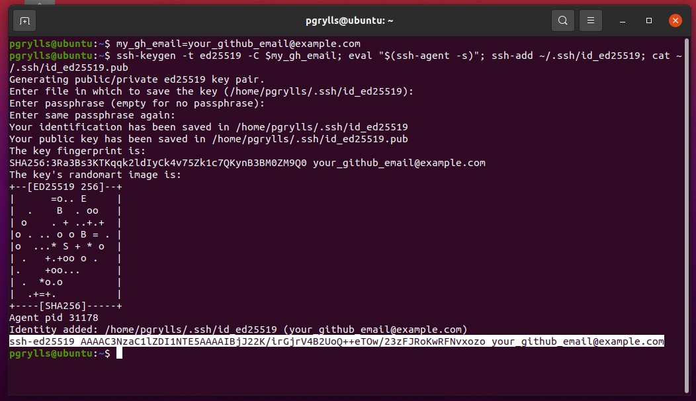
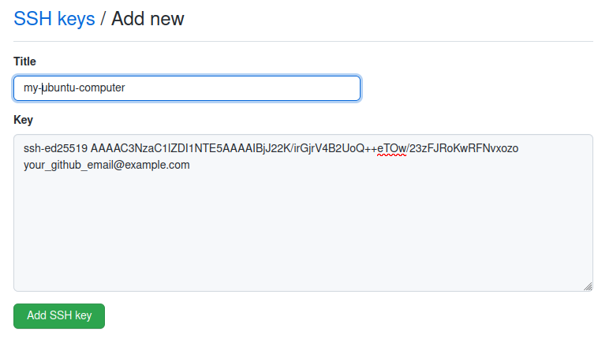

### Text Editor

A text editor is the piece of software you use to view and write code. If you
have a preferred text editor, please use it. Suggestions for text editors are,
Notepad++ (Windows), TextEdit (macOS), Gedit (GNU/Linux), GNU Nano, Vim.
Alternatively, there are IDE's (integrated developer environments) that have
more features specifically for coding such as VS Code; there are also IDEs
specific to languages will be listed in the appropriate section(s) below.

### Automating Tasks with the Unix Shell

#### Shell Setup 

You need to download some files to follow this lesson. First, you need to open a terminal:

- **On Windows:** run "Git Bash", to install git bash go here [https://gitforwindows.org/](https://gitforwindows.org/) click download and select 'Git-X.XX.X-64-bit.exe' from the assets list.
- **On Mac OS X:** accessed by opening the “Terminal” application, which can be found in the “Utilities” folder which is in your “Applications” folder.
- **On Linux:** this will depend on the Linux distribution you are running, but you should be able to find a "Terminal" application in your desktop's application menu.

Once you've done this, a window should appear. Type the following into the prompt that appears (pressing enter/return after each line):

~~~
$ cd
$ git clone https://github.com/Southampton-RSG/shell-novice.git
~~~
{: .language-bash}

Alternatively, if you have SSH authentication with GitHub enabled (if you don't know what this means don't worry, it is covered in the Git SWC course if you want to know more!) you can use the following:

~~~
$ cd
$ git clone git@github.com:Southampton-RSG/swc-shell-novice.git
~~~
{: .language-bash}

This should download all the content for the lesson to a new directory.
Please let the instructors know if you run into any problems.



### Version Control with git

#### Git Setup 

##### Windows
To install git bash go here [https://gitforwindows.org/](https://gitforwindows.org/) click download and select 'Git-X.XX.X-64-bit.exe' from the assets list.
Before we get started, we'll have to do a few things.

##### Mac OS
To use Git you must install the Apple Command Line Tools.  You can obtain these [from Apple](https://developer.apple.com/download/more/?name=command%20line%20tools%20for%20xcode%2012) (requires your Apple ID)

- Select **Command Line Tools for Xcode 12** and click the link to download the dmg archive.
- If prompted, choose to allow downloads from developer.apple.com
- Open the downloaded dmg archive from the Downloads folder
- Double-click the Command Line Tools.pkg icon to install



[The slides to accompany this material can be found here.]({{ slidelink }})


##### GitHub
Later on in the session, we'll be demonstrating how to share work with collaborators using GitHub. You'll need to create an account there: [https://github.com/](https://github.com/).

As your GitHub user name will appear in the URLs of your projects there, it's best to use a short, clear version of your name if you can.

In addition we will need to set up SSH access to GitHub from your computer. This is how GitHub checks that you are who you say you are when you try to add things from your computer.

When we do this, we generate a pair of keys - one public, one private. We want to add the public key to GitHub, whilst the private one stays on our computer.

There are full guides here [https://docs.github.com/en/authentication/connecting-to-github-with-ssh/generating-a-new-ssh-key-and-adding-it-to-the-ssh-agent](Make an SSH Key) and [https://docs.github.com/en/authentication/connecting-to-github-with-ssh/adding-a-new-ssh-key-to-your-github-account](Add an SSH key).

However today we have simplified it like so:

First we need to create a variable to store your GitHub email. Copy this command, substituting the email you signed up to GitHub with for `your_github_email@example.com`:
~~~
$ my_gh_email=your_github_email@example.com
~~~
{: .language-bash}

Then we can run the following command to generate a key-pair and display the public half:
~~~
$ ssh-keygen -t ed25519 -C $my_gh_email; eval "$(ssh-agent -s)"; ssh-add ~/.ssh/id_ed25519; cat ~/.ssh/id_ed25519.pub
~~~
{: .language-bash}

You will need to press enter a few times to select default options and set the passphrase to empty.

Copy the last output line that starts with `ssh-ed25519` and ends with your email (it may have gone over multiple lines if your terminal isn't wide enough).

{:width="50%"}

Finally, go to [https://github.com/settings/ssh/new](https://github.com/settings/ssh/new) (you will need to be logged into GitHub with the account you have created). Give the key a memorable name (the name of the computer you are working on is often a good choice) and paste the key from your clipboard into the box labelled key. Then, click add SSH key and you are done!

{:width="50%"}

Now we are ready to download the code that we need for this lesson, using Git on the command line. Open a terminal on your machine, and enter:
~~~
$ cd
$ git clone https://github.com/Southampton-RSG/swc-git-novice
~~~
{: .language-bash}

`cd` will move to your home directory, and `git clone` will download a copy of the materials.



### Building Programs with Python

#### Python Setup 

IDEs: PyCharm, Spyder, VS Code

We use Python 3*. The “Anaconda3” package provides everything Python-related you will need for the workshop. To install [Anaconda](https://www.anaconda.com/products/individual), follow the instructions below.

Some old research projects may be in Python 2 but Python 2 has been retired and new projects should be in Python 3.

##### Windows
Download the latest Anaconda Windows installer. Double-click the installer and follow the instructions. When asked “Add Anaconda to my PATH environment variable”, answer “yes”. After it’s finished, close and reopen any open terminals to reload the updated PATH and allow the installed Python to be found.

##### Mac OS X
Download the latest Anaconda Mac OS X installer. Double-click the .pkg file and follow the instructions.

##### Linux
Download the latest Anaconda Linux Installer. Install via the terminal like this,

~~~
$ bash Anaconda3-2021.11-Linux-x86_64.sh
~~~
{: .language-bash}

Answer ‘yes’ to allow the installer to initialize Anaconda3 in your .bashrc.
